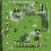
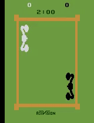

# Dreamer: Learning Behaviors by Latent Imagination

This repository contains an implementation of the Dreamer algorithm, introduced by Hafner et al. in their paper "Dream to Control: Learning Behaviors by Latent Imagination." This implementation closely follows the original paper, with clear and structured code that emphasizes readability and maintainability.

<div align="center">
  
  
</div>

## Features
- **Clean Implementation**: The Recurrent State Space Model (RSSM) is modularized into distinct transition, representation, and recurrent models, enhancing code clarity and extensibility.
- **Fidelity to Original Paper**: The implementation adheres closely to the methodologies and techniques outlined in the DreamerV1 paper by Hafner et al. This includes the incorporation of exploration noises, gradient clipping, and other critical aspects.
- **Structured Training Loop**: The training loop is structured and documented in a way that aligns with the descriptions provided in the original paper. Comments and documentation are included throughout the code to aid in understanding and further development.

## Citation
If you find this implementation useful, please consider citing the original paper:

```bibtex
@article{hafner2019dream,
  title={Dream to Control: Learning Behaviors by Latent Imagination},
  author={Hafner, Danijar and Lillicrap, Timothy and Norouzi, Mohammad and Ba, Jimmy},
  journal={arXiv preprint arXiv:1912.01603},
  year={2019}
}
