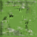

# PyDreamerV1: Clean pytorch implementation of Hafner et al Dreamer (WIP)

<div align="center">
  
  
  
</div>
<div align="center">
  
  
  
</div>


This repository offers a comprehensive implementation of the Dreamer algorithm, as presented in the groundbreaking work by Hafner et al., "Dream to Control: Learning Behaviors by Latent Imagination." Our implementation is dedicated to faithfully reproducing the innovative approach of learning and planning within a learned latent space, enabling agents to efficiently master complex behaviors through imagination alone.

## Why Dreamer?

Dreamer stands at the forefront of model-based reinforcement learning by introducing an efficient method for learning behaviors directly from high-dimensional sensory inputs. It leverages a latent dynamics model to 'imagine' future states and rewards, enabling it to plan and execute actions that maximize long-term rewards purely from simulated experiences. This approach significantly improves sample efficiency over traditional model-free methods and opens new avenues for learning complex and nuanced behaviors in simulated environments.

## Implementation Highlights

- **Modular Design**: My implementation of the Recurrent State Space Model (RSSM) is broken down into cleanly separated modules for the transition, representation, and recurrent models. This not only facilitates a deeper understanding of the underlying mechanics but also allows for easy customization and extension.

- **True to the Source**: By closely adhering to the methodologies detailed in the original DreamerV1 paper, the code captures the essence of latent space learning and imagination-driven planning. From the incorporation of exploration noise to the td lambda calculation, every element is designed to replicate the paper's results as closely as possible.

- **Detailed Training Insights**: The training loop is crafted with clarity in mind, mirroring the paper's process. Comprehensive comments and thorough documentation accompany the code, serving as a valuable resource for both learning and further research.

## Getting Started

1. **Clone the Repository**: Get the code by cloning this repository to your local machine.
   ```
   git clone https://github.com/minhphd/PyDreamerV1
   ```

2. **Install Dependencies**: Ensure you have all necessary dependencies by running:
   ```
   pip3 install -r requirements.txt
   ```

3. **Run the Training**: Kickstart the training process with a simple command:
   ```
   python main.py --config <Path to config file>
   ```

4. **Visualize Results**: Utilize TensorBoard to observe training progress and visualize the agent's performance in real-time.
   ```
   tensorboard --logdir=runs
   ```

## Citation

Consider citing the original Dreamer paper if you find this implementation instrumental to your research:

```bibtex
@article{hafner2019dream,
  title={Dream to Control: Learning Behaviors by Latent Imagination},
  author={Hafner, Danijar and Lillicrap, Timothy and Norouzi, Mohammad and Ba, Jimmy},
  journal={arXiv preprint arXiv:1912.01603},
  year={2019}
}
```

## Contributions

Contributions are welcome! Whether it's extending functionality, improving efficiency, or correcting bugs, your input helps make this project better for everyone.
